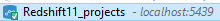
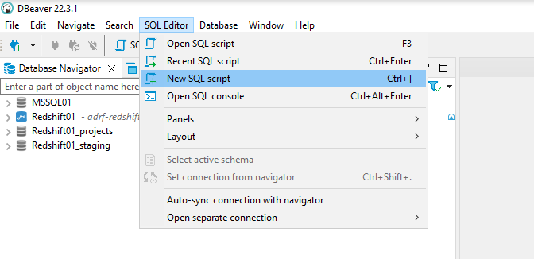
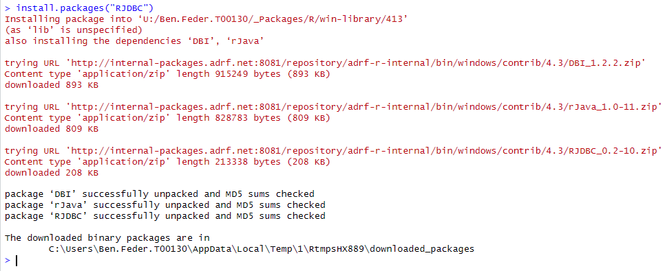
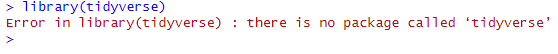
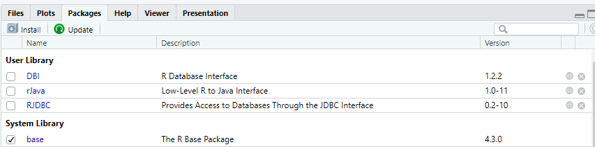

{fig-align="center"}

# Introduction
```{r setup, include=FALSE}
#HIDE THIS CHUNK FROM KNITTED OUTPUT
knitr::opts_chunk$set(include=TRUE, echo=TRUE, eval = FALSE,  warning = FALSE, fig.align = 'center')  #results=‘hide’) # needs to delete results=‘hide’
```
This notebook provides an empirical guide to measuring key components of the Postsecondary Value framework. We focus on the calculation of *Threshold 0 (T0)*, which reflects the minimum economic return, and *Threshold 3 (T3)*, which captures earnings mobility. 

In addition, we demonstrate how to derive the *Economic Value Index (EVI)*, which measures the share of students reaching a minimum return, and the *Equitable Value Contribution (EVC)*, which quantifies the economic impact generated by student success.

Using restricted use student data from the PASSHE system and wage data from the PA Department of Labor and Industry, we walk through the step-by-step construction of each metric. 

Mastering these measures is essential for evaluating how postsecondary institutions create, distribute, and sustain economic value for diverse student populations.

# Technical Setup

Code chunks in this notebook will be provided in both SQL and R, so follow the setup sections below if you are interested in establishing your own SQL and R environments for running the code.

Typically, throughout these workbooks, we use SQL for the majority of data exploration and creation of the analytic frame, and then read that analytic frame into R for the descriptive analysis and visualization. You will see options for writing SQL code in R, but not vice versa. We discuss this approach in a later section.

::: {.callout collapse="true"}
## SQL Setup

For working with the database directly using SQL, the easiest way is to still copy the SQL commands from this notebook (available within the `SQL Query` tab views) into a script in DBeaver. As a reminder, the steps to do so are as follows:

1.  Open DBeaver, located on the ADRF Desktop. The icon looks like this


2.  Establish your connection to the database by logging in. To do this, double-click `Redshift11_projects` on the left hand side, and it will ask for your username and password. Your username is `adrf\` followed by the name of your U: drive folder - for example, `adrf\JOhn.Doe.T00113`. Your password is the same password that you use to log into the ADRF.

After you successfully establish your connection, you should see a green check next to the database name, like so:



3.  In the top menu bar, click **SQL Editor** then **New SQL Script**:



4.  To test if your connection is working, try pasting the following chunk of code into your script:

```{sql, eval=FALSE}
SELECT *
FROM ds_pa_sshe.enrollment
LIMIT 5;
```

Then run it by clicking the run button next to the script, or by pressing CTRL + ENTER.

5.  You should then be able to see the query output in the box below the code.
:::

::: {.callout collapse="true"}
## R Setup

#### Install Packages {.unnumbered}

Because we have left the world of the Foundations Module and entered a new workspace, we need to re-install packages that are not native to the base R environment. **We only need to do this once - this workflow for programming in R is identical to that outside the ADRF.**

::: callout-note
In the ADRF, you are limited to installing packages available on the Comprehensive R Archive Networks, commonly referred to as CRAN. CRAN is the primary centralized repository for R packages. Packages must meet certain requirements before they can become available on CRAN. Outside the ADRF, you can install packages available on other repositories, such as those accessible on Github repositories.
:::

To install a package, in the console in R studio, type the following:

```{r, eval=FALSE}
install.packages('INSERT_PACKAGE_NAME')
```

For example, to install the package `RJDBC` (for establishing our connection to the database), you should type:

```{r, eval=FALSE}
install.packages("RJDBC")
```

If you run this, you should see a set of messages in your console similar to the below:



After running this, `RJDBC` will be installed for you within your ADRF workspace. You will not need to re-install it each time you log back into the workspace.

There are two simple ways to identify if a package has already been installed in your environment:

1.  You can run `library(INSERT_PACKAGE_NAME)`, and if it returns an error like the following, it has not been installed properly:



2.  You can manually check in the bottom right pane inside R Studio by selecting the Packages tab and seeing if the package is available. Packages should be sorted alphabetically and those with a check beside them have not just already been installed, but also loaded into the environment for use:



**To install all of the packages you will need for this notebook, please run the following:**

```{r, eval=FALSE}
install.packages(RJDBC)
install.packages(tidyverse)
install.packages(dbplyr)
```

Additionally, in order to establish our database connection in R, please install the following custom package that has already been uploaded into the P: drive of this workspace:

```{r, eval=FALSE}
install.packages("P:/tr-ihep-2025-pa/R_packages/ColeridgeInitiative_0.1.2.zip")
```

#### Load Libraries {.unnumbered}

After installing these packages, we next need to load them to make them available in our R environment. This is identical to the procedure we followed in the Foundations Module

```{r}
library(ColeridgeInitiative)
library(tidyverse)
library(dbplyr)
```
```{r, echo=FALSE}
options(should_show_types=FALSE)
```

#### Establish Database Connection {.unnumbered}

To load data from the Redshift server into R, we need to first set up a connection to the database. The following command will prompt you for password and establish the connection:

```{r}
con <- adrf_redshift(usertype = "training")
```
:::


# Measuring Threshold 0 in our cohort

To measure the `T0` threshold, we must proceed in several steps. 

Threshold 0, or Minimum Economic Return, can be explained in the following way: 
"*a student meets this threshold if they earn at least as much as a high school graduate plus enough to recoup their total net price plus interest within ten years*. Here, net price is defined as "*the total cost of attendance including living expenses, minus any grants or scholarships received, throughout the duration of time a student is enrolled at the institution.*" 

Furthermore, "*Threshold 0 is purposefully named such because it is the minimum that we should expect of institutions that students leave postsecondary education at least better off financially than if they had not attended*" (Postsecondary Value Commission, Executive Summary).

## Calculating Threshold 0

We can break down the development of Threshold 0 into the following steps:
 1. Estimate cost of attendance for each individual in our 2015 analytic frame (**nb_cohort_model**) for their ending institution and degree level. In this step we will also calculate the amount of loans for each student, for their degree. These costs have been calculated in the **pa_fact_cumulative_cost_noroom** table in the **tr_ihep_2025_pa** schema. This table also includes the **total_cost** field, which represents the net cost of attendance per institution and degree for each student. 
 2. Amortize annual net price with fixed federal interest rate for subsidized loans over 10 years (net price per year after exit).
 3. Aggregate to the individual student level (cumulative net yearly price).
 4. Link the cumulative net annual price to the non-zero median earnings of 22-40-year-old high school graduates in Pennsylvania derived from the American Community Survey (ACS). These earnings estimates are located in the **tr_ihep_2025_pa.pa_dim_thresholds** table. 
 5. Aggregate yearly earnings, discounted for inflation, for each completer and compare to the wages from the threshold table. 

### Step 1 - Calculating the cost of attendance
This query will use our cohort table `tr_ihep_2025_pa.nb_cohort_model` and link to the quarterly data model table, to get information on the quarter and year the degree was earned, and the institution the degree was received from. Next we link to the total cost of attendance table to get the total cost and the amount of loans received. 

```{sql}
#| connection: con
#| output.var: "cohort"
select a.*,
  pfqon.completed_primary_institution ,
  pfqon.completed_primary_degree_area ,
  pfcc.total_cost ,pfcc.total_loans ,
  pfcc.last_year_included 
from tr_ihep_2025_pa.nb_cohort_model a
join tr_ihep_2025_pa.pa_fact_quarterly_observation_new pfqon 
	on a.ssn = pfqon.ssn 
	and a.outcome_qtr =pfqon.quarter_id 
join tr_ihep_2025_pa.pa_fact_cumulative_cost_noroom pfcc 
	on a.ssn = pfcc.ssn 
	and pfqon.completed_primary_institution = pfcc.ipeds_unitid 
	and pfqon.completed_primary_degree_level = pfcc.ug_gr 
where a.completion_status = 'Y' 
	and pfqon.completed_primary_degree_level ='UG'
--limit 199


```


### Step 2 - Amortize annual net cost of attendance

Now, we would like to take the annual net price and amortize it over 10 years, assuming the fixed federal interest rate for subsidized loans. This will allow us to find the price per year after either completion or stop out. In this computation, we do not make the distinction between out of pocket and loan payments that fund an individual's educational pursuits.

We will use the following amortization formula to calculate this yearly sum:

$$ {12}*{p}\frac{(r)(1+r)^n}{(1+r)^n-1} $$


Where $p$ = annual net price, $r$ = monthly interest rate, and $n$ = number of payments over the lifetime (120 if amortized over 10 years with monthly payments)

We have ingested the interest rates as a csv file available in the **Public_data** folder, called `federal_interest_rates.csv`.

> Note: The annual rate is calculated from July 1 - June 30, which does not perfectly align with the fall start date of the financial aid year. For simplicity, we will join these years together, even though the months are slightly different.

```{r, message=FALSE, warning=FALSE}
## read in federal interest rates
fed_int_rates <- read_csv("P:/tr-ihep-2025-pa/Public_data/federal_interest_rates.csv" )

fed_int_rates
```

Next we join the interest rates to the cohort cost of attendance, and filter to have only those with non-zero cost of attendance, and apply the amortization formula to the total cost of attendance. 

```{r}
# find yearly price with 10-year amortization
# match year in fed_int_rates to the year in the current data frame
# first get monthly interest rate and roll up to the year (by multiplying by 12)
cohort_wages_t0_df_amort <- cohort %>%
  mutate(total_cost = as.numeric(total_cost),
  last_year = as.numeric(last_year_included)) %>% 
  filter(total_cost>0) %>% 
    inner_join( fed_int_rates, 
        by=c("last_year"= "year")  ) %>%
    mutate(month_int_rate = int_rate/12,
        amortized_net_price_year =12 * (total_cost * ((month_int_rate*(1+month_int_rate)^120) / (((1+month_int_rate)^120)-1))) )

# show how it looks for a person
cohort_wages_t0_df_amort %>%
    arrange(ssn, last_year_included) %>%
    head(n=20)
```


Here we simply summarize this annualized cost. 

```{r}
# view updated numerical summary of variable of interest
cohort_wages_t0_df_amort %>%
    select(amortized_net_price_year) %>%
    summary()
```

### Step 3 - Aggregate annual student costs

In the third step, we will sum the yearly price per year of enrollment to find the cumulative annual net price. 

```{r}
# add up each person's yearly amortized price
# will have one row per person, keeping ssn in group_by() to preserve the person

cohort_wages_t0_df_amort_s <- cohort_wages_t0_df_amort %>% 
    group_by(ssn) %>% 
    summarize(cumulative_price = sum(amortized_net_price_year)) %>% 
    ungroup()

head(cohort_wages_t0_df_amort_s, n = 20)
```

```{r}
# find amount with zero cumulative price
# can use count() b/c one row per person
cohort_wages_t0_df_amort_s %>% 
    mutate(zero_price_ind = ifelse(cumulative_price == 0, 'Y', 'N')) %>%
    count(zero_price_ind)
```
Based on our *estimated* yearly net prices for this cohort, there are just a few individuals leaving their bachelor's degree experience with it fully subsidized by gift aid.

### Step 4 - Compare to state thresholds

Finally, we can calculate our individual thresholds by adding the cumulative yearly price to the non-zero median earnings of 22-40-year-old high school graduates in Pennsylvania.

> Note: You can also aggregate these thresholds up to the subgroup level and beyond (e.g., institution, race/ethnicity, etc.) instead of focusing on individual thresholds. AND there are other states in the threshold table in addition to PA.

```{r}
threshold_pa_hs <- con %>% 
    tbl(in_schema(schema = "tr_ihep_2025_pa",
      table = "pa_dim_thresholds")) %>% 
filter(statefip == 42, gender == "all", race_eth == "all", educ_level == "hsged") %>% 
collect()

threshold_pa_hs

# median earnings for high school graduates
median_PA_HS = as.numeric(threshold_pa_hs$median)
```

```{r}
# sum to get individual thresholds
cohort_wages_t0_df_amort_s <- cohort_wages_t0_df_amort_s %>%
    mutate(threshold_0 = median_PA_HS + cumulative_price)

head(cohort_wages_t0_df_amort_s, n = 20)
```


We can then analyze the difference in average threshold value across other variables, here we use the `completed_primary_degree_area` field to see how costs vary across aggregate degree areas.

```{r}
# look at average threshold for different degree areas
# computing num_indiv to check we didn't lose anyone in the threshold creation
cohort_wages_t0_df_amort_s %>%
  left_join(cohort, by = "ssn") %>% 
    group_by(completed_primary_degree_area) %>%
    summarize(
        avg_threshold = mean(threshold_0), 
        n_indiv =n_distinct(ssn)) %>%
    ungroup()
```

### Step 5 Aggregate yearly earnings and comparing to thresholds

We will now bring in a linked postsecondary and workforce data asset to inspect individual outcomes on yearly bases relative to their threshold values. We can largely reuse our earlier code to develop this data frame - we will opt to follow the dimensional data model-based approach.

Because we will need to inflation-adjust wage records, we add in an additional join to the **tr_ihep_2025_pa.pa_fact_quarterly_observation_new** fact table to find the quarter and year associated with each observation. 

> Note: We will keep earnings at the quarterly grain despite developing the thresholds at the yearly level, as we will find the years relative to each individual's exit after providing the inflation adjustment. Although this distinction (relative to focusing on the calendar years relative to graduation) matters less as we look at longer term outcomes, it may affect one- and three-year outlooks.

```{sql}
#| connection: con
#| output.var: "cohort_wages"

with cohort as(
select a.*,
  pfqon.completed_primary_institution ,
  pfqon.completed_primary_degree_area ,
  pfcc.total_cost ,pfcc.total_loans ,
  pfcc.last_year_included , 
  pdqap.academic_year 
from tr_ihep_2025_pa.nb_cohort_model a
join tr_ihep_2025_pa.pa_fact_quarterly_observation_new pfqon 
	on a.ssn = pfqon.ssn 
	and a.outcome_qtr =pfqon.quarter_id 
join tr_ihep_2025_pa.pa_fact_cumulative_cost_noroom pfcc 
	on a.ssn = pfcc.ssn 
	and pfqon.completed_primary_institution = pfcc.ipeds_unitid 
	and pfqon.completed_primary_degree_level = pfcc.ug_gr 
join tr_ihep_2025_pa.pa_dim_quarterly_academic_periods pdqap  
	on pfqon.quarter_id = pdqap.quarter_id 
where a.completion_status = 'Y' 
	and pfqon.completed_primary_degree_level ='UG'
--limit 199
)
select cohort.ssn, cohort.outcome_qtr, cohort.race_ethnicity,
cohort.sex_code, cohort.completed_primary_institution,
cohort.completed_primary_degree_area ,cohort.academic_year,
cohort.total_cost ,cohort.total_loans , cohort.last_year_included,
fact.quarter_id , fact.employed_status ,
fact.primary_employer_wages , fact.total_wages,
fact.employer_count 
from cohort 
join tr_ihep_2025_pa.pa_fact_quarterly_observation_new  fact on (cohort.ssn = fact.ssn and
              cohort.outcome_qtr < fact.quarter_id and
              cohort.outcome_qtr + 120 >= fact.quarter_id)
order by cohort.ssn, fact.quarter_id 

```

```{r}
head(cohort_wages, n=50)
```


```{r}
# find quarter relative to exit
# set NA wages to 0 so future aggregations don't get set to NA
df_wages <- cohort_wages %>%
  mutate(primary_employer_wages = as.numeric(primary_employer_wages),
         total_wages = as.numeric(total_wages),
        q_after_exit = quarter_id - outcome_qtr, #wage qtr - completion quarter
        primary_employer_wages = ifelse(is.na(primary_employer_wages), 0, primary_employer_wages),
        total_wages = ifelse(is.na(total_wages), 0, total_wages) )

head(df_wages, n = 20)
```

Because we used a `LEFT JOIN` to link between our original cohort and the fact table, we may have observations for individuals who have since been filtered out of the analysis due to issues in calculating cost of attendance.

> Note: We will ignore observations for individuals no longer in our analytical frame when joining the data frame to the threshold information in a few code cells.

```{r}
# see that we have everyone in original cohort in df_wages
df_wages %>%
    summarize(n_distinct(ssn))

# compare to amount of individuals for which we have threshold info
cohort_wages_t0_df_amort_s %>%
    summarize(n_distinct(ssn))
```


#### Adjust wages for inflation
We have ingested the public Consumer Price Index for All Urban Consumers to inflation-adjust earnings. The median earnings from ACS have all been adjusted to 2021 dollars, so we will do the same for all wage records.

```{r}
# read in inflation adjustment and adjust relative to 2021
inflation_adj <- read_csv("P:/tr-ihep-2025-pa/Public_data/CPI_series.csv")

# find multiplier adjustment to 2021 dollars by dividing the 2021 value by that of the year in question
inflation_adj <- inflation_adj %>%
    mutate( adj = (inflation_adj %>% filter(year==2021) %>% pull(CPIU)) / CPIU )

head(inflation_adj)
```

```{r}
# add inflation adjustment data to wages, adjust wages on the calendar year
df_wages <- df_wages %>%
    inner_join(inflation_adj, by = c('academic_year' = 'year')) %>%
    mutate(
        total_wages_adj = total_wages * adj
    )

head(df_wages, n = 20)
```

Now that we have inflation-adjusted all earnings, we can aggregate this information to the relative annual level to ensure the year/quarter combinations of the wage records in question for a given year are adjusted by the semester of the individual's exit.

We will do so by considering the first year after exit as starting at the one year mark after exit, or the 5th through the 8th quarters after graduation, and find subsequent years after exit following the same approach.

> Note: if someone has less than 4 quarters of wages observed, we annualize the wages based on the number of quarters they are observed to have wages. We also add a  wages_imputed flag so we can track how wages differ by this imputation variable. We do not show results for imputed wages, so we filter these before graphing.


```{r}
# find relative year after exit for each individual, aggregate inflation-adjusted wages on the year
# floor() will always round down, to make sure 1-4 are year 1, need to subtract 1 so that it rounds down to 0 years after exit


df_wages_agg <- df_wages %>%
  filter(employed_status == 'Y') %>%
  mutate( y_after_exit = floor((q_after_exit - 1) / 4)) %>%
  group_by(ssn, y_after_exit) %>%
  summarize(  total_wages = sum(total_wages_adj),
    n_qtr = n_distinct(q_after_exit),
    .groups = 'drop') %>%
  mutate(  yearly_wages = if_else(n_qtr < 4, total_wages * (4 / n_qtr), total_wages),
wages_imputed = n_qtr < 4 ) %>% 
  filter(n_qtr==4)


head(df_wages_agg, 50)
```

We can join this information back to that of our annual threshold values per person.

> Note: Recall that the annual thresholds do not change over time per person.

```{r}
# join quarterly wage information to annual thresholds
# arrange to show for one person
df_wages_linked <- df_wages_agg %>% 
    inner_join(cohort_wages_t0_df_amort_s, by = 'ssn') %>%
    arrange(ssn, y_after_exit)

head(df_wages_linked, n = 20)
```
## Analyzing Threshold 0

```{r}
# create threshold indicator
# find percentage meeting threshold by cohort and year after exit
meet <- df_wages_linked %>%
    mutate(  meets_threshold = ifelse(yearly_wages >= threshold_0, 1, 0)) %>%
group_by( wages_imputed) %>% 
    count(y_after_exit, meets_threshold) %>%
    group_by( y_after_exit, wages_imputed) %>%
    mutate(
        perc = 100*n/sum(n)
    ) %>%
    ungroup() %>%
    # optional filter to only highlight percentage meeting threshold (1-percentage = those not meeting threshold)
    filter(meets_threshold == 1)

meet
```


```{r}
# plot findings
meet %>% 
filter(wages_imputed == FALSE) %>% 
    ggplot(aes(x=y_after_exit, y=perc, group= 1)) +
    geom_line( aes(lty =  wages_imputed))+
labs(title = "Percent of 2015 cohort completers meeting T0", 
  subtitle = "Imputed vs Complete Wages")+
    xlab( "Years after completion")+ 
    ylab ("Percentage exceeding T0")
```

We can restrict the findings to specific years of interest - the Postsecondary Value Framework calls for findings at 1, 3, 5, and 10 years after exit.

> Note: Due to our cohort selection, we will not be able to find percentages 10 years after exit in this example. 

```{r}
# plot findings at 1, 3, and 5 years after exit
meet %>% 
    filter(y_after_exit %in% c(1,3,5)) %>%
    ggplot(aes(x=as.character(y_after_exit), y=perc, fill=wages_imputed)) +
    geom_col( position = position_dodge())+
labs(title = "Percent of 2015 cohort completers meeting T0")+
    xlab( "Years after completion")+ 
    ylab ("Percentage exceeding T0")
```

We can see that though a high percentage of completers are meeting the thresholds. 

## Analysis of T0 by Field of Study
A fundamental question related to T0 is how do different programs affect the likelihood of meeting or exceeding the threshold. Here, we link the wage data used above back to our cohort completion information to examine this.


```{r}
wages_linked<- cohort %>%
  select(ssn, sex_code, race_ethnicity, pellrecipient, completed_primary_degree_area) %>% 
  right_join(df_wages_linked, by ="ssn")

head(wages_linked, n = 20)
```


> NOTE: This code writes out the person-level data used for the threshold data. It provides an example in case you want to do this yourself.

```{r, eval=FALSE}
nb_analysis_table<-wages_linked %>% 
mutate(meets_threshold0 = ifelse(yearly_wages >= threshold_0, 1, 0),
meets_threshold_t3 = ifelse(yearly_wages >= T3_PA, 1, 0))
library(DBI)
dbWriteTable(con,
             SQL("tr_ihep_2025_pa.nb_measurement_data"),
            nb_analysis_table,
             overwrite = TRUE)

dbExecute(con, "GRANT SELECT, UPDATE, DELETE, INSERT ON TABLE tr_ihep_2025_pa.nb_measurement_data  TO group ci_read_group")
```


```{r}
meet_field <- wages_linked %>%
    mutate(  meets_threshold = ifelse(yearly_wages >= threshold_0, 1, 0)  ) %>%
group_by( wages_imputed, completed_primary_degree_area) %>% 
    count(y_after_exit, meets_threshold) %>%
ungroup() %>% 
    group_by( y_after_exit, completed_primary_degree_area, wages_imputed) %>%
    mutate(
        perc = 100*n/sum(n)
    ) %>%
    ungroup() %>%
    # optional filter to only highlight percentage meeting threshold (1-percentage = those not meeting threshold)
    filter(meets_threshold == 1)

meet_field

```

```{r, fig.width= 8 , fig.height=6}

meet_field %>% 
    filter(y_after_exit %in% c(1,3,5)) %>%
    ggplot(aes(x=as.character(y_after_exit), y=perc, 
          group=completed_primary_degree_area,
          color=completed_primary_degree_area)) +
    geom_line(lwd = 1.5)+
  scale_color_brewer(palette = "Dark2")+
labs(title = "Percent of 2015 cohort completers meeting T0")+
    xlab( "Years after completion")+ 
    ylab ("Percentage exceeding T0")

```

# Measuring the T3 threshold
Threshold 3, or Earnings Mobility, measures if a student surpasses the 60th percentile of earnings among workers with positive earnings in the same state the institution is located. Threshold 3 examines economic mobility by measuring whether students earn enough to enter the fourth income quintile *regardless of their field of study*. (Postsecondary Value Commission, Executive Summary).

Similar to the T0 threshold, the state-specific T3 threshold values are stored in the `tr_ihep_2025_pa.pa_dim_thresholds` table, and the 60th percentiles for wages are in the `p60` field. Since this threshold is measured regardless of field of degree, we will use wages for those with a Bachelors degree in our calculation.


```{r}
threshold_pa_t3 <- con %>% 
    tbl(in_schema(schema = "tr_ihep_2025_pa",
      table = "pa_dim_thresholds")) %>% 
filter(statefip == 42, gender == "all", race_eth == "all", educ_level == "all", degfield=='all') %>% 
collect()

threshold_pa_t3

# 60th percentile for earnings
T3_PA = as.numeric(threshold_pa_t3$p60)
T3_PA
```


```{r}
meet_field_t3 <- wages_linked %>%
filter(yearly_wages > 0) %>% 
    mutate( meets_threshold_t3 = ifelse(yearly_wages >= T3_PA, 1, 0)) %>%
group_by( wages_imputed) %>% 
    count(y_after_exit, meets_threshold_t3) %>%
ungroup() %>% 
    group_by( y_after_exit, wages_imputed) %>%
    mutate(perc = 100*n/sum(n)) %>%
    ungroup() %>%
    # optional filter to only highlight percentage meeting threshold 3 (1-percentage = those not meeting threshold)
    filter(meets_threshold_t3 == 1)

meet_field_t3

```

```{r, fig.width= 8 , fig.height=6}

meet_field_t3 %>% 
    ggplot(aes(x=as.character(y_after_exit), y=perc, group = wages_imputed)) +
    geom_line(lwd = 1.5)+
  scale_color_brewer(palette = "Dark2")+
labs(title = "Percent of 2015 cohort completers meeting Threshold T3")+
    xlab( "Years after completion")+ 
    ylab ("Percentage exceeding T3")

```


# Economic Value Index Calculation
The *Economic Value Index (EVI)* measures the proportion of a student subgroup that completes a credential and earns above the minimum economic return (Threshold 0), weighted by the subgroup's share of total completers. It reflects how equitably institutions deliver economic value to different student populations.

To measure it, we use the proportion of completers in our cohort that exceed T0, and multiply that by the percentage of students in the specified group, here we use race/ethnicity.  

```{r}
meet_field <- wages_linked %>%
    mutate( meets_threshold = ifelse(yearly_wages >= threshold_0, 1, 0)) %>%
group_by( wages_imputed, race_ethnicity) %>% 
    count(y_after_exit, meets_threshold) %>%
ungroup() %>% 
    group_by( y_after_exit, race_ethnicity, wages_imputed) %>%
    mutate(
        perc = 100*n/sum(n)
    ) %>%
    ungroup() %>%
    # optional filter to only highlight percentage meeting threshold (1-percentage = those not meeting threshold)
    filter(meets_threshold == 1)

meet_field

```

Here we get the percentage of students by race/ethnicity in our cohort.

```{r}

pct_students <- wages_linked %>% 
group_by(race_ethnicity) %>% 
summarize(n = n()) %>%
ungroup() %>% 
mutate(pct =100* (n /sum(n))) %>% 
arrange(desc(pct))


pct_students

```

Next we calculate the proportion of students with wages over threshold 0 for each race/ethnic group, then we multiply that by the percentage of students in each race/ethnic group. 

```{r}
evi = wages_linked %>% 
    mutate(meets_threshold = ifelse(yearly_wages >= threshold_0, 1, 0)) %>%
group_by( wages_imputed, race_ethnicity) %>% 
    count(y_after_exit, meets_threshold) %>%
ungroup() %>% 
    group_by( y_after_exit, race_ethnicity, wages_imputed) %>%
    mutate(perc = 100*n/sum(n)) %>%
    ungroup() %>%
    # optional filter to only highlight percentage meeting threshold (1-percentage = those not meeting threshold)
    filter(meets_threshold == 1) %>% 
left_join(pct_students, by = "race_ethnicity") %>% 
mutate(evi_calc = perc/100 * pct/100)

evi
```

Here we plot the EVI 3 years after completion for unimputed wages, by race/ethnicity. 

```{r, fig.width=8, fig.height=8}

evi %>% 
filter(y_after_exit == 3, wages_imputed ==F) %>% 
ggplot(aes(x = race_ethnicity, y = evi_calc, fill=race_ethnicity))+
geom_col()+
theme(axis.text.x = element_text(angle = 90, vjust = 0.5, hjust=1))+
labs(title = "EVI by Race/Ethnicity", subtitle = "3 years post-completion")+
xlab("Race/ethnicity")+
ylab("EVI")

```

# Economic Value Contribution (EVC) Calculation

The *Equitable Value Contribution *(EVC)* quantifies the total economic impact generated by completers whose earnings exceed Threshold 0. It is calculated by multiplying the earnings surplus (median earnings minus T0) by the number of completers in each group. EVC can be expressed as both a dollar amount and as a percentage of an institution's total value contribution.

Here we sum the net wages above Threshold 0 by race and ethnicity, and then multiply this sum by the percentage of students in each group.

```{r}
evc = wages_linked %>% 
    mutate(evc = yearly_wages - threshold_0) %>%
    group_by( y_after_exit,wages_imputed, race_ethnicity) %>% 
    summarize(sum_evc = sum(evc)) %>% 
  ungroup() %>%
  left_join(pct_students, by = "race_ethnicity") %>% 
  mutate(evc_calc = sum_evc * pct/100) %>% 
  group_by( y_after_exit, wages_imputed) %>% 
  mutate(pct_evc = evc_calc/sum(evc_calc))

evc
```

```{r, fig.width=8, fig.height=8}

evc %>% 
filter(y_after_exit == 3, wages_imputed ==F) %>% 
ggplot(aes(x = race_ethnicity, y = pct_evc, fill=race_ethnicity))+
geom_col()+
theme(axis.text.x = element_text(angle = 90, vjust = 0.5, hjust=1))+
labs(title = "EVC Percentage by Race/Ethnicity", subtitle = "3 years post-completion")+
xlab("Race/Ethnicity Group")+
ylab("EVC Percentage")

```


# Using this notebook for your project

This workbook provides a structure for you to start you to start measuring these key thresholds within the scope of your project. We have outlined the general methods for using the thresholds for a cohort, by following along and using the code shown above, this should allow you  to focus on the measurements and outcomes most relevant to your specific project.

As you evaluate further variable distributions, you can re-purpose the code chunks in this notebook. In doing so, we recommend noting your findings in your team's project template. As your project progresses, it will be helpful to look back at these notes, especially in thinking through how to most accurately communicate your team's final product to an external audience. Ultimately, measuring outcomes such as those shown above is an essential step in the project development life cycle, as it provides helpful contextual information on the variables you may choose to use in your analysis.

For all of these steps, remember not to takes notes or discuss the exact results outside the ADRF. Instead, create notes or output inside the ADRF, and store them either in your U: drive or in your team's folder on the P: drive. When discussing results with your team, remember to speak broadly, and instead direct them to look at specific findings with the ADRF. As always, feel free to reach out to the Coleridge team if you have any questions as you get used to this workflow!